# Watermark Removal Convolutional Neural Network
Machine Learning Engineer (aspiring): Ian H. Ryan 
Version: 0.1 
Timeline: May 22, 2025 - June 24th, 2025  

Upon making a variety of image scrapers for the world wide web, I noticed that a portion of the images I found contained watermarks. This sprung the idea of creating a deep learning model with the use case of removing watermarks from images. I found a research paper on ArXiv called <a href="https://arxiv.org/html/2403.05807v1" target="_blank">
        A self-supervised CNN for image watermark removal
    </a>. I used it as a reference for this project. This is a Image Restoration (Regression) Deep Learning Model.

# Environment
- **Make & Model**:        Alienware m15 R7
- **GPU**:                 NVIDIA GeForce RTX 3060 Mobile (6 GB VRAM)
- **Secondary GPU**:       Integrated AMD Radeon Graphics
- **CPU**:                 AMD Ryzen 7 6800H (16 threads @ 4.78 GHz)
- **RAM**:                 16 GB DDR5
- **CUDA Version**:        CUDA Version: 12.8
- **Operating System**:    Pop!_OS 22.04 LTS
- **Kernel**:              6.12.10-76061203-generic

# Notebook Index
## **Table of Contents**
- [Libraries & Imports](#libraries--imports)
  - [Libraries](#libraries)
  - [Imports](#imports)
- [CUDA](#icuda)
  - [Check GPU Availability for CUDA](#check-gpu-availability-for-cuda)
  - [CUDA allocation limiting ~64mb](#cuda-allocation-limiting-64mb)
- [Seed](#seed)
- [Dataset Description](#datasetinfo)
- [CNN Model](#cnn-model)
  - [Model Architecture](#model-arch)
  - [MixedLoss Loss Function](#loss-func)
  - [Total Parameters](#tot-param)
- [Data Generation (Self-Supervised)](#data-gen-ss)
  - [DataSet Class](#data-class)
- [Hyperparameters](#hyperparameters)
  - [Batch Size, Epochs, Learning Rate, Weight Decay](#batch-epoch-lr-weightdecay-steps)
- [Transform](#transform)
- [Pathing](#pathing)
- [Data Loader](#data-loaders)
- [Criterion, Optimizer, & Scaler for AMP](#crit-opt-scaler-amp)
- [Training CNN Model](#training-cnn-model)
- [Save Summary for Regression Task Report JSON](#save-sum-reg-report)
- [Log Training History](#log-training-history)
- [Create ChangeLog](#create-changelog)
- [Create ChangeLog & Config](#create-changelog--config)
- [Save Model Weights or Save Model of Training](#save-model-weights-or-save-model-of-training)
- [Test Accuracy of CNN Training](#test-accuracy-of-cnn-training)
- [Visualizations & Metrics](#vis-metrics)
  - [Metrics](#metrics)
    - [Summary](#summary)
    - [Evaluation Cell (For Restoration CNN)](#evaluate-cell)
    - [Test Results CSV & JSON](#test-results)
  - [Visuals](#visuals)
    - [Residual Histogram](#res-hist)
    - [Local PSNR/SSIM Maps](#loc-psnrssim)
    - [Side by side Comparison](#side-comp)
    - [Watermark Residual](#wm-res)
    - [Training Progress](#train-prog)
    - [Watermark Attention](#wm-att)
    - [Batch Processing](#batch-proc)
    - [Learning Rate Visual](#learning-rate-visual)
    - [Train Loss, Peak Signal-to-Noise Ratio, Structural Similarity Index](#ind-plots)
    - [Residual Error](#res-error)
    - [Multi-Layer Activation](#mult-act)
    - [Feature Activation Maps (Decoder Focus)](#dec-focus)
    - [Kernel/Visualizations](#kernelvisualizations)
    - [Gradient Visualization](#gradient-visualization)
- [Literature Cited](#literature-cited)
- [Environment](#environment)
- [Recommended Resources](#recommended-resources)
- [Permission](#permission)

# Dataset Description
Utilized self-supervised pairing & watermark synthesis. Thus not being reliant on finding a myriad of paired images with watermark and without watermark.   
This project is trained from data that I scraped off of the internet from various sources while making image scrapers. With that being said, I will not be providing downloads to the data. 
- 1000 images, 996 jpg, 4 png file types. 
  
Aim to create or find a dataset that is diverse in textures, colors, brightness, edges, and backgrounds.

    If you need datasets consider checking out: 
    <a href="https://www.kaggle.com/datasets/" target="_blank">
        Kaggle | 
    </a>
    <a href="https://public.roboflow.com/" target="_blank">
        Roboflow | 
    </a>
    <a href="https://cocodataset.org/#download" target="_blank">
        COCO
    </a>

 
The dataset I threw together contains selfies, group pictures, nature, cities, animals, parties, etc.

# Heterogeneous U-Net CNN Architecture
- **Encoder-Decoder Backbone** - multi-resolution feature extraction.
- **DoubleConv Blocks** - ReLU and LeakyReLU to capture diverse activations.
- **Attention Gates** - at each skip connection for feature relevance gating.
- **Learnable Upsampling (Transpose Convs)** avoid interpolation artifcats from bilinear.
- **Self-Attention Bottleneck** - global spatial context.
- **Perceptual Feature Extractor (VGG16)** - texture-aware loss.

  

# Loss Function
There are multiple components to the loss function.

### 1) Masked L1 Loss
Penalizes per pixel differences between predicted & ground truth images, optionally focusing on the masked region (where the watermark is located). 
 
Formula: 
        L1_masked = (1/N) ∑_(i=1)^(N) ​M_i * ∣P_i − T_i∣  

    
   Where: 
   - P_i: Predicted Pixel 
   - T_i: Target Pixel 
   - M_i: Binary Mask (1=focus, 0=ignore) 
   - N: Sum of Mask Values (non-zero pixels)

### 2) LAB Color Loss
Transforms images to LAB color space & weights L-channel more (70%) to prioritize luminance, which human eyes are more sensitive to. 
 
Formula: 
        LAB_loss = (0.7) * L1(L_p,L_t) + (0.3) * L1(𝐴𝐵_𝑝, 𝐴𝐵_𝑡)  

    
   Where: 
   - L_p, L_t: Luminance channels (predicted, target)
   - 𝐴𝐵_𝑝, 𝐴𝐵_𝑡: Chrominance channels

### 3) Perceptual Loss (VGG16)
Uses pre-trained VGG16 to extract deep features from intermediate layers and compares their activations. 
 
Formula: 
        Perceptual_loss = L1(ϕ(P),ϕ(T))  

    
   Where: 
   - ϕ: Feature extractor from pretrained VGG16 
   - P,T: Predicted and target images

### 4) SSIM (Structural Similarity Index)
Captures structural similarity of images over patches. 
 
Formula: 
        SSIM_loss = (1 - SSIM(P,T))

    
   SSIM compares means, variances, and covariances of image patches. It’s luminance-driven and more perceptually aligned than L1.

### 5) Laplacian Edge Loss
Applies a Laplacian kernel to both predicted and target images to extract edges, then uses L1 on the resulting edge maps. 
 
Formula: 
        Edge_loss = L1((∇^2)P,(∇^2)T)  

    
   Where: 
   - ∇^2 is the Laplacian operator.

### Total Loss
Formula: 
        Total Loss = L1 + α * Perceptual + β * LAB + γ * SSIM + δ * Laplacian
          
weights: 
   - α=0.3 
   - β=0.3 
   - γ=0.4 
   - δ=0.1
   

  

# Total Parameters
Total Parameters: 5383366 
Trainable Parameters: 3647878  

The reason only 3647878 are trainable is that the other 1735488 are being used in VGG

# Data Generation (Self-Supervised)
This section contains: Watermark Generation, Watermark Application, Generate Pair, Data Augmentation, & Watermark Dataset Class  
The model learns from synthetic watermark pairs that are generated from the myriad of 1000 clean images I used in the dataset.

### Watermark Generation
Creates a diverse variety of synthetic watermarks.  
- Watermark text contains 25 multi-langual phrases or watermarks. For example, ENG, SPAN, FR, GER, CH, JAP, KOR, RUSS, ARA, HIN.  
- The watermarks vary in size, rotations, opacity, & positions. As well as partial occlusion.  
- A slight amount of watermarks generated were lines, rectangles, & circles as opposed to text for more diversity. 
- Distortions: post processing with image filters to replicate low quality scanning or camera captures.    
### Semi-Random Alpha Blending (Applying Watermark)
The watermark is integrated into the clean image via spatially varying alpha mask:  
- Random opacity levels across image.  
- Occasional brightness & contrast adjustments  
- Binary supervision mask generated simultaneously to mark affected regions.  
### Generate Pair (Pairwise Training)
Each training sample is a triplet: 
- wm_img1: The input with a synthetic watermark  
- wm_img2: A second watermarked version (reference)  
- mask: The region where the watermark is present (used for masked L1 and Laplacian loss)  
 
This mirrors the core idea in the research paper referenced, Simulates watermark removal in the absence of ground truth. It simulates the learning signal by generating different but related views of the same clean image.

###  Data Augmentation Pipeline (Albumentations)
Goal of enhancing robustness & domain generalization: 
- Geometric: crop, rotate, flip  
- Photometric: jitter, grayscale, gamma  
- Noise/Artifacts: blur, compression, rain, shadows, pixel dropout  

# Hyperparameters
- batch_size = 8
- epochs = 25
- learning_rate = 0.001
- weight_decay = 1e-5

# Transform
create transform variable and set image size to 256 pixels. 
transform = get_augmentations(image_size=256)

# Pathing
data/clean_images/*.jpg & data/clean_images/*.png  
convert clean image data to RGB  
 
split %:  
train: 70% 
validate: 20% 
test: 10% 
 
Train: 699, Val: 200, Test: 100

## Loss, Optimizer, GradScaler for AMP & Learning Rate Scheduler
<pre>criterion = ColorAwareLoss(alpha=0.3, beta=0.3, gamma=0.4, delta=0.1).to(device) </pre>
- Perceptual weight (alpha): α=0.3  
- Color weight (beta): β=0.3  
- SSIM weight (gamma): γ=0.4  
- Laplacian weight (delta): δ=0.1   

## AdamW Optimizer Algorithm
<pre>optimizer = torch.optim.AdamW(net.parameters(), lr=learning_rate, weight_decay=weight_decay) </pre>
Model is trained on AdamW optimization algorithm. It decouples weight decay from gradient updates which allows for better generalization & stability in training.   
AdamW applies weight decay directly to the parameters, not the gradients like Adam which in turn improves generalization.

## GradScaler for AMP
<pre>scaler = torch.cuda.amp.GradScaler() </pre>
Keeping GPU memory & training speed in mind, I utilized Automatic Mixed Precision (AMP) through the GradScaler. It dynamically scales gradients preventing underflow during the mixed precision training.
 

## OneCycleLR Learning Rate Scheduler
<pre>scheduler = torch.optim.lr_scheduler.OneCycleLR(
    optimizer,
    max_lr=0.001,
    steps_per_epoch=len(train_loader),
    epochs=epochs + 2,
    pct_start=0.3,
    div_factor=10,
    final_div_factor=100

```mermaid
%%{init: {'theme': 'base', 'themeVariables': { 'primaryColor': '#ffd8d8', 'edgeLabelBackground':'#ffffff'}}}%%
graph LR
    A[Warmup Phase 2 epochs LR: 1e-4] --> B[OneCycleLR Ramp-Up 30% of epochs LR: 1e-4 → 1e-3]
    B --> C[Cosine Annealing\n70% of epochs LR: 1e-3 → 1e-5]
    C --> D[Final LR: 1e-5]

    style A fill:#e3f7fc,stroke:#333
    style B fill:#fff2cc,stroke:#333
    style C fill:#ffe6e6,stroke:#333
    style D fill:#e8f5e9,stroke:#333
```

) </pre>   

Using OneCycleLR Learning Rate Scheduler. It is a dynamic scheduelr that:  
- warms up learning rate early in training.  
- Anneal to lower value nearing end of training.
- Improves convergence & generalization.

# Training

# Referenced Paper
https://arxiv.org/html/2403.05807v1
<a href="https://arxiv.org/html/2403.05807v1" target="_blank">
        A self-supervised CNN for image watermark removal
    </a> by Chunwei Tian, Member, IEEE, Menghua Zheng, Tiancai Jiao, Wangmeng Zuo, Senior Member, IEEE, Yanning Zhang, Senior Member, IEEE, Chia-Wen Lin, Fellow, IEEE from 9 Mar 2024
