# Watermark Removal Convolutional Neural Network
Machine Learning Engineer (aspiring): Ian H. Ryan<br>
Version: 0.1<br>
Timeline: May 22, 2025 - June 24th, 2025<br><br>

Upon making a variety of image scrapers for the world wide web, I noticed that a portion of the images I found contained watermarks. This sprung the idea of creating a deep learning model with the use case of removing watermarks from images. I found a research paper on ArXiv called <a href="https://arxiv.org/html/2403.05807v1" target="_blank">
        A self-supervised CNN for image watermark removal
    </a>. I used it as a reference for this project. This is a Image Restoration (Regression) Deep Learning Model.

# Environment
- **Make & Model**:        Alienware m15 R7
- **GPU**:                 NVIDIA GeForce RTX 3060 Mobile (6 GB VRAM)
- **Secondary GPU**:       Integrated AMD Radeon Graphics
- **CPU**:                 AMD Ryzen 7 6800H (16 threads @ 4.78 GHz)
- **RAM**:                 16 GB DDR5
- **CUDA Version**:        CUDA Version: 12.8
- **Operating System**:    Pop!_OS 22.04 LTS
- **Kernel**:              6.12.10-76061203-generic

# Notebook Index
## **Table of Contents**
- [Libraries & Imports](#libraries--imports)
  - [Libraries](#libraries)
  - [Imports](#imports)
- [CUDA](#icuda)
  - [Check GPU Availability for CUDA](#check-gpu-availability-for-cuda)
  - [CUDA allocation limiting ~64mb](#cuda-allocation-limiting-64mb)
- [Seed](#seed)
- [Dataset Description](#datasetinfo)
- [CNN Model](#cnn-model)
  - [Model Architecture](#model-arch)
  - [MixedLoss Loss Function](#loss-func)
  - [Total Parameters](#tot-param)
- [Data Generation (Self-Supervised)](#data-gen-ss)
  - [DataSet Class](#data-class)
- [Hyperparameters](#hyperparameters)
  - [Batch Size, Epochs, Learning Rate, Weight Decay](#batch-epoch-lr-weightdecay-steps)
- [Transform](#transform)
- [Pathing](#pathing)
- [Data Loader](#data-loaders)
- [Criterion, Optimizer, & Scaler for AMP](#crit-opt-scaler-amp)
- [Training CNN Model](#training-cnn-model)
- [Save Summary for Regression Task Report JSON](#save-sum-reg-report)
- [Log Training History](#log-training-history)
- [Create ChangeLog](#create-changelog)
- [Create ChangeLog & Config](#create-changelog--config)
- [Save Model Weights or Save Model of Training](#save-model-weights-or-save-model-of-training)
- [Test Accuracy of CNN Training](#test-accuracy-of-cnn-training)
- [Visualizations & Metrics](#vis-metrics)
  - [Metrics](#metrics)
    - [Summary](#summary)
    - [Evaluation Cell (For Restoration CNN)](#evaluate-cell)
    - [Test Results CSV & JSON](#test-results)
  - [Visuals](#visuals)
    - [Residual Histogram](#res-hist)
    - [Local PSNR/SSIM Maps](#loc-psnrssim)
    - [Side by side Comparison](#side-comp)
    - [Watermark Residual](#wm-res)
    - [Training Progress](#train-prog)
    - [Watermark Attention](#wm-att)
    - [Batch Processing](#batch-proc)
    - [Learning Rate Visual](#learning-rate-visual)
    - [Train Loss, Peak Signal-to-Noise Ratio, Structural Similarity Index](#ind-plots)
    - [Residual Error](#res-error)
    - [Multi-Layer Activation](#mult-act)
    - [Feature Activation Maps (Decoder Focus)](#dec-focus)
    - [Kernel/Visualizations](#kernelvisualizations)
    - [Gradient Visualization](#gradient-visualization)
- [Literature Cited](#literature-cited)
- [Environment](#environment)
- [Recommended Resources](#recommended-resources)
- [Permission](#permission)

# Dataset Description
Utilized self-supervised pairing & watermark synthesis. Thus not being reliant on finding a myriad of paired images with watermark and without watermark. <br><br>
This project is trained from data that I scraped off of the internet from various sources while making image scrapers. With that being said, I will not be providing downloads to the data.<br>
- 1000 images, 996 jpg, 4 png file types.<br>
<br> 
Aim to create or find a dataset that is diverse in textures, colors, brightness, edges, and backgrounds.

<p>
    If you need datasets consider checking out: 
    <a href="https://www.kaggle.com/datasets/" target="_blank">
        Kaggle | 
    </a>
    <a href="https://public.roboflow.com/" target="_blank">
        Roboflow | 
    </a>
    <a href="https://cocodataset.org/#download" target="_blank">
        COCO
    </a>
</p>

<br>
The dataset I threw together contains selfies, group pictures, nature, cities, animals, parties, etc.

# Heterogeneous U-Net CNN Architecture
- **Encoder-Decoder Backbone** - multi-resolution feature extraction.
- **DoubleConv Blocks** - ReLU and LeakyReLU to capture diverse activations.
- **Attention Gates** - at each skip connection for feature relevance gating.
- **Learnable Upsampling (Transpose Convs)** avoid interpolation artifcats from bilinear.
- **Self-Attention Bottleneck** - global spatial context.
- **Perceptual Feature Extractor (VGG16)** - texture-aware loss.

<div align="center">
  
</div>

# Loss Function
There are multiple components to the loss function.

### 1) Masked L1 Loss
Penalizes per pixel differences between predicted & ground truth images, optionally focusing on the masked region (where the watermark is located).<br>
<br>
Formula:<br>
        L1_masked = (1/N) ∑_(i=1)^(N) ​M_i * ∣P_i − T_i∣ <br>

   <br>
   Where:<br>
   - P_i: Predicted Pixel<br>
   - T_i: Target Pixel<br>
   - M_i: Binary Mask (1=focus, 0=ignore)<br>
   - N: Sum of Mask Values (non-zero pixels)

### 2) LAB Color Loss
Transforms images to LAB color space & weights L-channel more (70%) to prioritize luminance, which human eyes are more sensitive to.<br>
<br>
Formula:<br>
        LAB_loss = (0.7) * L1(L_p,L_t) + (0.3) * L1(𝐴𝐵_𝑝, 𝐴𝐵_𝑡) <br>

   <br>
   Where:<br>
   - L_p, L_t: Luminance channels (predicted, target)
   - 𝐴𝐵_𝑝, 𝐴𝐵_𝑡: Chrominance channels

### 3) Perceptual Loss (VGG16)
Uses pre-trained VGG16 to extract deep features from intermediate layers and compares their activations.<br>
<br>
Formula:<br>
        Perceptual_loss = L1(ϕ(P),ϕ(T)) <br>

   <br>
   Where:<br>
   - ϕ: Feature extractor from pretrained VGG16<br>
   - P,T: Predicted and target images

### 4) SSIM (Structural Similarity Index)
Captures structural similarity of images over patches.<br>
<br>
Formula:<br>
        SSIM_loss = (1 - SSIM(P,T))

   <br>
   SSIM compares means, variances, and covariances of image patches. It’s luminance-driven and more perceptually aligned than L1.

### 5) Laplacian Edge Loss
Applies a Laplacian kernel to both predicted and target images to extract edges, then uses L1 on the resulting edge maps.<br>
<br>
Formula:<br>
        Edge_loss = L1((∇^2)P,(∇^2)T) <br>

   <br>
   Where:<br>
   - ∇^2 is the Laplacian operator.

### Total Loss
Formula:<br>
        Total Loss = L1 + α * Perceptual + β * LAB + γ * SSIM + δ * Laplacian
        <br><br>
weights:<br>
   - α=0.3<br>
   - β=0.3<br>
   - γ=0.4<br>
   - δ=0.1
   
<div align="center">
  
</div>

# Total Parameters
Total Parameters: 5383366<br>
Trainable Parameters: 3647878<br><br>

The reason only 3647878 are trainable is that the other 1735488 are being used in VGG

# Data Generation (Self-Supervised)
This section contains: Watermark Generation, Watermark Application, Generate Pair, Data Augmentation, & Watermark Dataset Class <br>
The model learns from synthetic watermark pairs that are generated from the myriad of 1000 clean images I used in the dataset.

### Watermark Generation
Creates a diverse variety of synthetic watermarks. <br>
- Watermark text contains 25 multi-langual phrases or watermarks. For example, ENG, SPAN, FR, GER, CH, JAP, KOR, RUSS, ARA, HIN. <br>
- The watermarks vary in size, rotations, opacity, & positions. As well as partial occlusion. <br>
- A slight amount of watermarks generated were lines, rectangles, & circles as opposed to text for more diversity.<br>
- Distortions: post processing with image filters to replicate low quality scanning or camera captures. <br> <br>
### Semi-Random Alpha Blending (Applying Watermark)
The watermark is integrated into the clean image via spatially varying alpha mask: <br>
- Random opacity levels across image. <br>
- Occasional brightness & contrast adjustments <br>
- Binary supervision mask generated simultaneously to mark affected regions. <br>
### Generate Pair (Pairwise Training)
Each training sample is a triplet:<br>
- wm_img1: The input with a synthetic watermark <br>
- wm_img2: A second watermarked version (reference) <br>
- mask: The region where the watermark is present (used for masked L1 and Laplacian loss) <br>
<br>
This mirrors the core idea in the research paper referenced, Simulates watermark removal in the absence of ground truth. It simulates the learning signal by generating different but related views of the same clean image.

###  Data Augmentation Pipeline (Albumentations)
Goal of enhancing robustness & domain generalization:<br>
- Geometric: crop, rotate, flip <br>
- Photometric: jitter, grayscale, gamma <br>
- Noise/Artifacts: blur, compression, rain, shadows, pixel dropout <br>

# Hyperparameters
- batch_size = 8
- epochs = 25
- learning_rate = 0.001
- weight_decay = 1e-5

# Transform
create transform variable and set image size to 256 pixels.<br>
<pre>transform = get_augmentations(image_size=256)</pre>

# Pathing
data/clean_images/*.jpg & data/clean_images/*.png <br>
convert clean image data to RGB <br>
<br>
split %: <br>
train: 70%<br>
validate: 20%<br>
test: 10%<br>
<br>
Train: 699, Val: 200, Test: 100

## Loss, Optimizer, GradScaler for AMP & Learning Rate Scheduler
<pre>criterion = ColorAwareLoss(alpha=0.3, beta=0.3, gamma=0.4, delta=0.1).to(device) </pre>
- Perceptual weight (alpha): α=0.3 <br>
- Color weight (beta): β=0.3 <br>
- SSIM weight (gamma): γ=0.4 <br>
- Laplacian weight (delta): δ=0.1 <br><br>

## AdamW Optimizer Algorithm
<pre>optimizer = torch.optim.AdamW(net.parameters(), lr=learning_rate, weight_decay=weight_decay) </pre>
Model is trained on AdamW optimization algorithm. It decouples weight decay from gradient updates which allows for better generalization & stability in training.  <br>
AdamW applies weight decay directly to the parameters, not the gradients like Adam which in turn improves generalization.


## GradScaler for AMP
<pre>scaler = torch.cuda.amp.GradScaler() </pre>
Keeping GPU memory & training speed in mind, I utilized Automatic Mixed Precision (AMP) through the GradScaler. It dynamically scales gradients preventing underflow during the mixed precision training.
<br>

## OneCycleLR Learning Rate Scheduler
<pre>scheduler = torch.optim.lr_scheduler.OneCycleLR(
    optimizer,
    max_lr=0.001,
    steps_per_epoch=len(train_loader),
    epochs=epochs + 2,
    pct_start=0.3,
    div_factor=10,
    final_div_factor=100

```mermaid
%%{init: {'theme': 'base', 'themeVariables': { 'primaryColor': '#ffd8d8', 'edgeLabelBackground':'#ffffff'}}}%%
graph LR
    A[Warmup Phase 2 epochs LR: 1e-4] --> B[OneCycleLR Ramp-Up 30% of epochs LR: 1e-4 → 1e-3]
    B --> C[Cosine Annealing\n70% of epochs LR: 1e-3 → 1e-5]
    C --> D[Final LR: 1e-5]

    style A fill:#e3f7fc,stroke:#333
    style B fill:#fff2cc,stroke:#333
    style C fill:#ffe6e6,stroke:#333
    style D fill:#e8f5e9,stroke:#333
```

) </pre> <br><br>



Using OneCycleLR Learning Rate Scheduler. It is a dynamic scheduelr that: <br>
- warms up learning rate early in training. <br>
- Anneal to lower value nearing end of training.
- Improves convergence & generalization.

# Training
Forward Propogation, Loss Calculation, Backward Propagation, Weight Update.<br><br>

### Warmup Loop
Making adjustments to the hyperparameters, architecture, loss functions, etc can cause early epochs to act up adjusting to the changes made. Thus implementing a warmup loop. <br>
- A 2-epoch warmup with a reduced learning rate (1e-4) using a separate AdamW optimizer to stabilize initial convergence.<br>

### Training Loop
training runs for 25 epochs (27 including the 2 warmup) using the main AdamW optimizer & OneCycleLR learning rate scheduler. <br>
- Manual learning rate decay is applied at epoch 15 (10x drop) to encourage finer convergence.<br>
- Epochs compute: Train Loss, Train PSNR, Train SSIM, Val Loss, VaL PSNR, Val SSIM, LR <br>
- Best-performing model (lowest val loss) is saved to wm_best_model.pth <br>
- Training halts early if no improvement is seen for early_stop_patience epochs.

### Results:
```
Warmup Epoch 1 | Loss: 6.72903
Warmup Epoch 2 | Loss: 3.8560
Epoch [1/25]: 100%|█████████████████████████████████████████████████| 88/88 [06:20<00:00,  4.32s/it]
Epoch 1: Train Loss=4.7524, Train PSNR=14.79, Train SSIM=0.3273 , Val Loss=4.1361, Val PSNR=15.20, Val SSIM=0.3542, LR=0.000134
Epoch [2/25]: 100%|█████████████████████████████████████████████████| 88/88 [06:36<00:00,  4.51s/it]
Epoch 2: Train Loss=3.8627, Train PSNR=16.61, Train SSIM=0.3853 , Val Loss=2.8606, Val PSNR=18.33, Val SSIM=0.4380, LR=0.000229
Epoch [3/25]: 100%|█████████████████████████████████████████████████| 88/88 [06:33<00:00,  4.48s/it]
Epoch 3: Train Loss=2.6319, Train PSNR=19.94, Train SSIM=0.4862 , Val Loss=1.6640, Val PSNR=22.47, Val SSIM=0.5786, LR=0.000372
Epoch [4/25]: 100%|█████████████████████████████████████████████████| 88/88 [06:37<00:00,  4.52s/it]
Epoch 4: Train Loss=1.5781, Train PSNR=23.88, Train SSIM=0.6011 , Val Loss=1.2799, Val PSNR=24.28, Val SSIM=0.6117, LR=0.000542
Epoch [5/25]: 100%|█████████████████████████████████████████████████| 88/88 [06:26<00:00,  4.39s/it]
Epoch 5: Train Loss=1.3406, Train PSNR=25.09, Train SSIM=0.6366 , Val Loss=1.1182, Val PSNR=25.67, Val SSIM=0.6214, LR=0.000713
Epoch [6/25]: 100%|█████████████████████████████████████████████████| 88/88 [06:38<00:00,  4.53s/it]
Epoch 6: Train Loss=1.3366, Train PSNR=25.31, Train SSIM=0.6567 , Val Loss=0.9333, Val PSNR=26.98, Val SSIM=0.6998, LR=0.000860
Epoch [7/25]: 100%|█████████████████████████████████████████████████| 88/88 [06:33<00:00,  4.48s/it]
Epoch 7: Train Loss=1.3522, Train PSNR=25.02, Train SSIM=0.6596 , Val Loss=1.0313, Val PSNR=26.46, Val SSIM=0.6463, LR=0.000960
Epoch [8/25]: 100%|█████████████████████████████████████████████████| 88/88 [06:35<00:00,  4.50s/it]
Epoch 8: Train Loss=1.2893, Train PSNR=25.61, Train SSIM=0.6700 , Val Loss=1.0174, Val PSNR=26.29, Val SSIM=0.6912, LR=0.001000
Epoch [9/25]: 100%|█████████████████████████████████████████████████| 88/88 [06:39<00:00,  4.53s/it]
Epoch 9: Train Loss=1.2259, Train PSNR=25.95, Train SSIM=0.6788 , Val Loss=0.9617, Val PSNR=26.69, Val SSIM=0.6800, LR=0.000994
Epoch [10/25]: 100%|████████████████████████████████████████████████| 88/88 [06:31<00:00,  4.45s/it]
Epoch 10: Train Loss=1.2163, Train PSNR=26.00, Train SSIM=0.6792 , Val Loss=0.9782, Val PSNR=26.75, Val SSIM=0.6751, LR=0.000975
Epoch [11/25]: 100%|████████████████████████████████████████████████| 88/88 [06:44<00:00,  4.59s/it]
Epoch 11: Train Loss=1.2225, Train PSNR=26.00, Train SSIM=0.6952 , Val Loss=0.8795, Val PSNR=27.65, Val SSIM=0.7164, LR=0.000943
Epoch [12/25]: 100%|████████████████████████████████████████████████| 88/88 [06:36<00:00,  4.51s/it]
Epoch 12: Train Loss=1.2029, Train PSNR=26.03, Train SSIM=0.6865 , Val Loss=0.9174, Val PSNR=27.46, Val SSIM=0.6902, LR=0.000898
Epoch [13/25]: 100%|████████████████████████████████████████████████| 88/88 [06:42<00:00,  4.57s/it]
Epoch 13: Train Loss=1.1444, Train PSNR=26.32, Train SSIM=0.6899 , Val Loss=0.8914, Val PSNR=27.29, Val SSIM=0.6994, LR=0.000843
Epoch [14/25]: 100%|████████████████████████████████████████████████| 88/88 [06:34<00:00,  4.49s/it]
Epoch 14: Train Loss=1.2011, Train PSNR=26.00, Train SSIM=0.6932 , Val Loss=0.8762, Val PSNR=27.71, Val SSIM=0.7081, LR=0.000778
Epoch [15/25]: 100%|████████████████████████████████████████████████| 88/88 [06:43<00:00,  4.59s/it]
Epoch 15: Train Loss=1.1981, Train PSNR=26.01, Train SSIM=0.6880 , Val Loss=0.8976, Val PSNR=27.41, Val SSIM=0.7213, LR=0.000705
Lowering learning rate by 10x for fine-tuning phase.
Epoch [16/25]: 100%|████████████████████████████████████████████████| 88/88 [06:41<00:00,  4.56s/it]
Epoch 16: Train Loss=1.1729, Train PSNR=26.21, Train SSIM=0.6848 , Val Loss=0.9213, Val PSNR=27.10, Val SSIM=0.6916, LR=0.000627
Epoch [17/25]: 100%|████████████████████████████████████████████████| 88/88 [06:43<00:00,  4.59s/it]
Epoch 17: Train Loss=1.1742, Train PSNR=26.08, Train SSIM=0.6929 , Val Loss=0.9165, Val PSNR=26.96, Val SSIM=0.7061, LR=0.000545
Epoch [18/25]: 100%|████████████████████████████████████████████████| 88/88 [06:57<00:00,  4.74s/it]
Epoch 18: Train Loss=1.1629, Train PSNR=26.25, Train SSIM=0.6963 , Val Loss=0.8613, Val PSNR=27.75, Val SSIM=0.7229, LR=0.000462
Epoch [19/25]: 100%|████████████████████████████████████████████████| 88/88 [06:46<00:00,  4.62s/it]
Epoch 19: Train Loss=1.1667, Train PSNR=26.12, Train SSIM=0.6958 , Val Loss=0.8495, Val PSNR=27.56, Val SSIM=0.7105, LR=0.000380
Epoch [20/25]: 100%|████████████████████████████████████████████████| 88/88 [06:46<00:00,  4.62s/it]
Epoch 20: Train Loss=1.1428, Train PSNR=26.28, Train SSIM=0.6810 , Val Loss=0.8530, Val PSNR=27.83, Val SSIM=0.7173, LR=0.000302
Epoch [21/25]: 100%|████████████████████████████████████████████████| 88/88 [06:46<00:00,  4.62s/it]
Epoch 21: Train Loss=1.1608, Train PSNR=26.27, Train SSIM=0.6959 , Val Loss=0.8109, Val PSNR=27.90, Val SSIM=0.7294, LR=0.000229
Epoch [22/25]: 100%|████████████████████████████████████████████████| 88/88 [06:31<00:00,  4.45s/it]
Epoch 22: Train Loss=1.1382, Train PSNR=26.19, Train SSIM=0.6985 , Val Loss=0.8479, Val PSNR=27.54, Val SSIM=0.7122, LR=0.000163
Epoch [23/25]: 100%|████████████████████████████████████████████████| 88/88 [06:39<00:00,  4.54s/it]
Epoch 23: Train Loss=1.0897, Train PSNR=26.64, Train SSIM=0.7037 , Val Loss=0.8687, Val PSNR=27.52, Val SSIM=0.7099, LR=0.000107
Epoch [24/25]: 100%|████████████████████████████████████████████████| 88/88 [06:37<00:00,  4.52s/it]
Epoch 24: Train Loss=1.1151, Train PSNR=26.60, Train SSIM=0.7008 , Val Loss=0.8570, Val PSNR=27.33, Val SSIM=0.7125, LR=0.000061
Epoch [25/25]: 100%|████████████████████████████████████████████████| 88/88 [06:36<00:00,  4.50s/it]
Epoch 25: Train Loss=1.1098, Train PSNR=26.65, Train SSIM=0.6970 , Val Loss=0.8431, Val PSNR=27.54, Val SSIM=0.7151, LR=0.000028

Training Time Elapsed: 228.00 Minutes
```
Summary:
- The warmup phase helped stabilize initial training as seen with the loss going from 6.72903 -> 3.8560 from first to second warmup epoch.
- Train PSNR started at ~14.8 dB and reached ~26.6 dB
- Val PSNR steadily improved to ~27.5–28 dB, a solid metric for image restoration tasks.
- Val SSIM reached ~0.72, indicating perceptual quality and structure recovery are good.


# Metrics & Visuals
All of the outputs that I used to make adjustments to the model as needed after each training run.
## Metrics
### Evaluation
```
Test Loss: 0.7706
Test PSNR: 28.67 dB
Test SSIM: 0.7202
```
## Visuals

### Train & Val Loss, PSNR Progress
<div align="center">
  
</div>
Plots show loss & PSNR over time for both training and validation sets. These curves verify the convergence behavior of the network, confirm generalization to unseen validation data, and track performance metrics epoch-by-epoch.


### Training Loss, Peak Signal to Noise Ratio, & Structural Similarity Plots
<div align="center">
  
</div>
Three synchronized subplots provide a compact summary of the network’s learning trajectory:<br>
- Loss Curve: steady convergence from high initial error.<br>
- PSNR Curve: clear climb toward 26–27 dB, a common benchmark in high-fidelity restoration.<br>
- SSIM Curve: shows perceptual similarity nearing ~0.70, indicating structural retention of clean images.

### Learning Rate Scheduler
<div align="center">
  
</div>
OneCycleLR plot shows the cyclical learning rate schedule used during training. The LR increases for the first 30% of epochs (warm-up), then decays gradually—helping the model converge quickly while avoiding sharp minima.

### Local PSNR & Local SSIM Maps
<div align="center">
  
</div>
These heatmaps depict spatially localized Peak Signal-to-Noise Ratio (PSNR) and Structural Similarity Index (SSIM) metrics across image patches. Brighter regions indicate higher fidelity restoration, offering insight into performance variability across different spatial contexts
<div align="center">
  
</div>

### Residual Histogram
<div align="center">
  
</div>
histogram displays the distribution of absolute pixel-wise residuals between the predicted image and the original watermark-free image. A sharp peak near zero indicates strong restoration fidelity, where most pixels are accurately reconstructed with minimal error.

### Side by Side Comparison
<div align="center">
  
</div>
Visual triplets are shown in three columns: the clean original, the watermarked version, and the predicted output. These qualitative results help highlight how well the model removes diverse watermark styles, maintaining visual structure and content.

### Watermark Residual
<div align="center">
  
</div>
A three-panel plot visualizes the residual heatmap, a binary thresholded mask, and the original vs predicted absolute difference. This highlights exactly where watermark artifacts remain and how well they’re suppressed in the output.

### Watermark Attention
<div align="center">
  
</div>
Decoder-level attention maps (heatmaps) illustrate how different layers in the network respond to watermark perturbations. This diagnostic tool verifies that deeper layers are focusing on regions corrupted by watermarks—demonstrating task-specific feature learning.

### Batch Processing
<div align="center">
  
</div>
This view shows the entire training batch as input, reference, and predicted samples across multiple augmentations. It’s useful to understand the model’s robustness to various synthetic watermark styles generated on-the-fly.

### Residual Error 
<div align="center">
  
</div>
Highlights pixel-level discrepancies between the original and predicted outputs using three subplots:<br>
- Residual Heatmap: This shows the absolute error (|original - predicted|) in pixel intensities. Brighter areas signify larger prediction errors, often correlated with watermark regions.<br>
- Thresholded Mask (> 0.1): Highlights only those pixels where the residual exceeds a certain perceptual threshold (0.1). This isolates major prediction faults or watermark remnants.<br>
- Overlay of Original vs Predicted: Gives a side-by-side visual of the predicted error distribution relative to the original image, making it easy to spot spatial trends in reconstruction quality.<br>
 Helps pinpoint where the model struggles, and guides improvements to the network or loss function.

### Multi-Layer Activation 
<div align="center">
  
</div>
Visualizes encoder and decoder layer outputs (e.g., enc1, enc2, dec1, dec2, dec3). Which reveals internal representation learning and feature abstraction across layers. It is useful for understanding how watermark-related features propagate through the network.

### Feature Activation Maps (Decoder Focus) 
<div align="center">
  
</div>
Feature maps from deeper decoder layers of the U-Net architecture:<br>
- The right-side plot shows the activation map from dec3 (final decoder layer before output), scaled from 0 to 1.<br>
- It reveals where the model is focusing its attention during reconstruction, particularly in recovering watermark-affected areas.<br>
The decoder’s high response in watermark-heavy zones suggests successful spatial attention learning. This also acts as a diagnostic tool to ensure the decoder is not ignoring important visual features.

# Referenced Paper
```bibtex
@article{liu2024heterogeneous,
  title={Heterogeneous U-Net for Image Restoration},
  author={Liu, Jiang and Zhang, Yulun and Li, Wangmeng and others},
  journal={arXiv preprint arXiv:2403.05807},
  year={2024},
  url={https://arxiv.org/abs/2403.05807}
}
```
